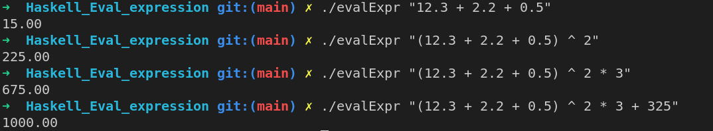

# Intro

Simple expresion evaluater in haskell.


# Usage and install

The makefile is at the root (use stack):

```
> make 
> ./evalExpr "(150 + (350 / 2) * 2) * 2.5"
> 1250.00
```

##### Alternative 

`ghc app/Main.hs  src/Parser.hs -o evalExpr`

#### Haddle 
float numbers, parentheses and the following binary operators:
1. sum (+) and difference (-)
1. product (*) and division (\\)
1. power (^)

#### Demo
